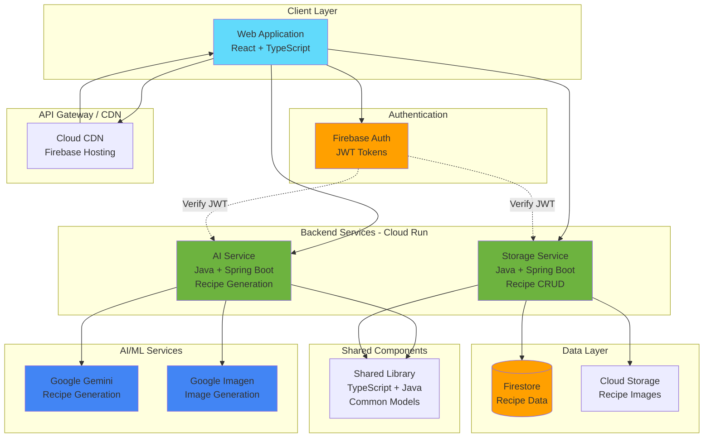
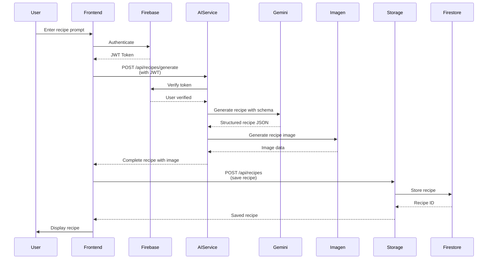
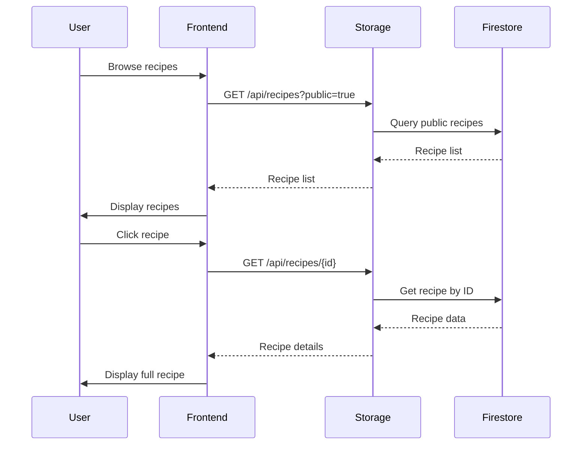
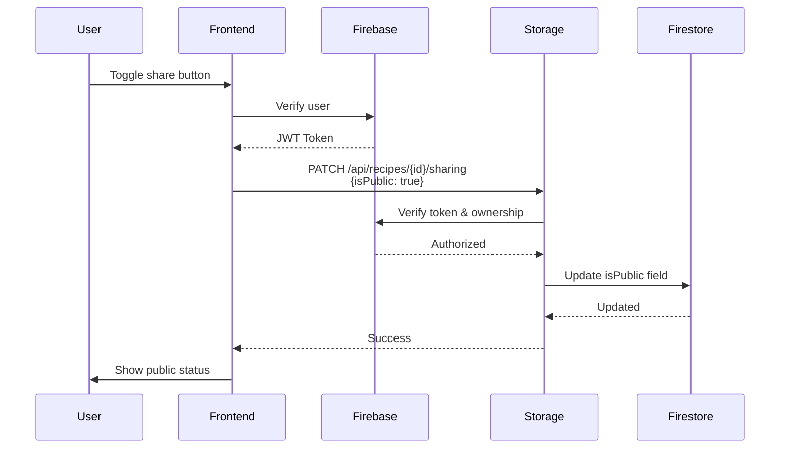
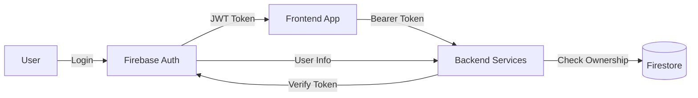
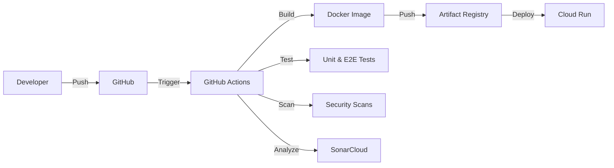

# Architecture Overview

## System Architecture

The Recipe Management Platform is built using a microservices architecture deployed on Google Cloud Platform (GCP), with a modern web frontend hosted on Firebase.

## Service Details

### Frontend Application

**Repository**: [recipe-management-frontend](https://github.com/theandiman/recipe-management-frontend)

**Tech Stack**:
- React 19 with TypeScript
- Redux Toolkit for state management
- Tailwind CSS for styling
- Firebase SDK for authentication
- Axios for HTTP requests
- Vite for development and builds

**Key Features**:
- User authentication and profile management
- Recipe browsing and search
- AI-powered recipe generation interface
- Recipe creation and editing
- Public recipe sharing
- Cooking mode with step-by-step instructions
- Responsive design for mobile and desktop

**Deployment**:
- Hosted on Firebase Hosting
- CI/CD via GitHub Actions
- Automatic deployment on merge to main

### AI Service

**Repository**: [recipe-management-ai-service](https://github.com/theandiman/recipe-management-ai-service)

**Tech Stack**:
- Java 21
- Spring Boot 6.2
- Google Vertex AI SDK
- OpenAPI/Swagger documentation
- Maven for dependency management

**API Endpoints**:
- `POST /api/recipes/generate` - Generate recipe from prompt
- `POST /api/recipes/image/generate` - Generate recipe image

**Key Features**:
- Integration with Google Gemini for recipe generation
- Integration with Google Imagen for image generation
- Structured JSON schema for consistent recipe output
- Support for dietary preferences and allergies
- Unit and max time constraints
- Pantry item suggestions

**Deployment**:
- Google Cloud Run (containerized)
- Auto-scaling based on demand
- Cloud Build for CI/CD
- Artifact Registry for container storage

**API Documentation**: https://theandiman.github.io/recipe-management-ai-service/

### Storage Service

**Repository**: [recipe-management-storage-service](https://github.com/theandiman/recipe-management-storage-service)

**Tech Stack**:
- Java 21
- Spring Boot 6.2
- Firebase Admin SDK
- Firestore for data persistence
- OpenAPI/Swagger documentation

**API Endpoints**:
- `GET /api/recipes` - List recipes (with filters)
- `GET /api/recipes/{id}` - Get recipe by ID
- `POST /api/recipes` - Create new recipe
- `PUT /api/recipes/{id}` - Update recipe
- `DELETE /api/recipes/{id}` - Delete recipe
- `PATCH /api/recipes/{id}/sharing` - Update sharing status

**Key Features**:
- Full CRUD operations for recipes
- User ownership and authorization
- Public/private recipe visibility
- Firebase Authentication integration
- Firestore for scalable storage
- Cloud Storage for recipe images

**Deployment**:
- Google Cloud Run (containerized)
- Auto-scaling based on demand
- Cloud Build for CI/CD
- Artifact Registry for container storage

**API Documentation**: https://theandiman.github.io/recipe-management-storage-service/

### Shared Library

**Repository**: [recipe-management-shared](https://github.com/theandiman/recipe-management-shared)

**Purpose**: Provide consistent data models across TypeScript and Java services

**Packages**:
- `@theandiman/recipe-management-shared` (npm - TypeScript)
- `com.recipe:recipe-management-shared` (Maven - Java)

**Key Components**:
- `Recipe` interface/class
- `NutritionalInfo` models
- `RecipeTips` models
- `RecipeSchema` for Gemini AI
- Utility functions for data conversion

**Distribution**:
- Published to GitHub Packages (npm & Maven)
- Versioned releases with automated publishing
- Dual TypeScript/Java builds

### Infrastructure

**Repository**: [recipe-management-infrastructure](https://github.com/theandiman/recipe-management-infrastructure)

**Tech Stack**:
- Terraform for GCP resources
- Pulumi for Firebase configuration
- Cloud Build for CI/CD

**Managed Resources**:
- Cloud Run services and configurations
- Firestore database setup
- Cloud Storage buckets
- IAM roles and service accounts
- VPC and networking
- Firebase projects and apps
- Environment variables and secrets

## Data Flow

### Recipe Generation Flow

### Recipe Retrieval Flow

### Recipe Sharing Flow

## Security Architecture

### Authentication & Authorization

**Security Layers**:
1. **Firebase Authentication**: User identity management
2. **JWT Tokens**: Stateless authentication for API calls
3. **Backend Verification**: Each service verifies tokens with Firebase
4. **Ownership Checks**: Services verify user owns resources before mutations
5. **CORS Policies**: Restrict API access to authorized origins
6. **Secret Management**: Secrets stored in Cloud Secret Manager

### Security Features

- **Secret Scanning**: Gitleaks pre-commit hooks prevent credential leaks
- **Dependency Scanning**: Renovate monitors for security vulnerabilities
- **Code Quality**: SonarCloud analyzes code for security issues
- **IAM Policies**: Least-privilege access for service accounts
- **Network Security**: Cloud Run with VPC connector for private services
- **Data Encryption**: Firestore encryption at rest and in transit

## Deployment Architecture

### CI/CD Pipeline

**Pipeline Steps**:
1. Code pushed to GitHub
2. GitHub Actions triggered
3. Run linting and tests
4. Security scanning (Gitleaks, SonarCloud)
5. Build Docker container
6. Push to Artifact Registry
7. Deploy to Cloud Run
8. Run smoke tests

### Environment Strategy

- **Development**: `recipe-mgmt-dev` (Firebase project)
- **Production**: Future production environment

**Environment Separation**:
- Separate Firebase projects per environment
- Dedicated Cloud Run services
- Environment-specific configuration via Cloud Build substitutions
- Isolated Firestore databases

## Scalability & Performance

### Auto-Scaling

**Cloud Run Services**:
- Automatic scaling from 0 to N instances
- Configurable concurrency (80-100 requests per instance)
- CPU and memory allocation per service
- Startup and request timeout configurations

### Performance Optimizations

**Frontend**:
- Code splitting with Vite
- Lazy loading of routes
- Image optimization
- CDN caching via Firebase Hosting

**Backend**:
- Connection pooling for Firestore
- Caching of frequent queries
- Optimistic UI updates
- Efficient pagination

**Database**:
- Indexed queries in Firestore
- Composite indexes for complex queries
- Document batching for bulk operations

## Monitoring & Observability

### Logging

- **Structured Logging**: JSON logs with correlation IDs
- **Cloud Logging**: Centralized log aggregation
- **Log Levels**: INFO, WARN, ERROR with appropriate filtering

### Metrics

- **Cloud Monitoring**: Request rates, latencies, errors
- **Custom Metrics**: Recipe generation success rates, image generation times
- **Alerting**: Configured for service degradation and errors

### Tracing

- **Cloud Trace**: Distributed request tracing across services
- **Performance Insights**: Identify bottlenecks in AI generation

## Cost Optimization

- **Cloud Run**: Pay only for request handling time
- **Firestore**: Pay per operation and storage
- **Vertex AI**: Per-request pricing for Gemini and Imagen
- **Auto-scaling**: Scale to zero when idle
- **Caching**: Reduce redundant API calls

## Future Enhancements

### Planned Features
- [ ] Recipe recommendations based on user preferences
- [ ] Meal planning and grocery lists
- [ ] Social features (comments, ratings, follows)
- [ ] Recipe collections and cookbooks
- [ ] Multi-language support
- [ ] Mobile native apps (iOS/Android)
- [ ] Recipe import from URLs
- [ ] Nutrition tracking
- [ ] Cooking timers and notifications

### Technical Improvements
- [ ] GraphQL API for more efficient queries
- [ ] Redis caching layer
- [ ] Event-driven architecture with Pub/Sub
- [ ] Advanced search with Algolia or Elasticsearch
- [ ] Production environment setup
- [ ] Blue-green deployments
- [ ] Canary releases
- [ ] A/B testing framework
